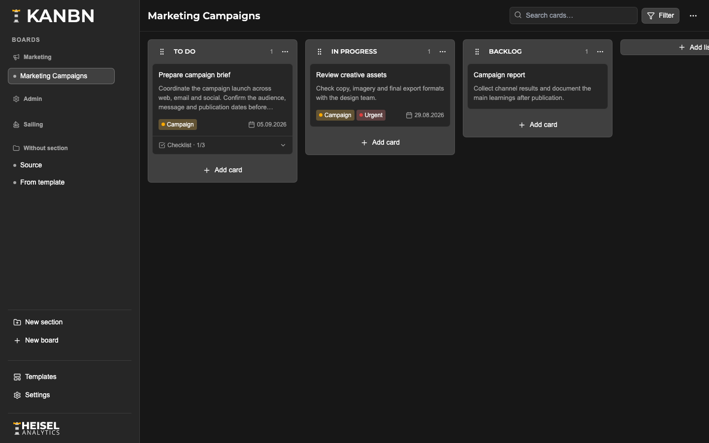

# KANBN

KANBN is an MIT-licensed, focused, self-hosted Kanban application for a trusted single-instance environment. It opens directly on the last used board and deliberately has no login, users, workspaces, members, roles, invitations, billing, or multi-tenant layer.

## Screenshots



## Features

- Board, list, and card CRUD with soft deletion
- Freely named board sections with reversible board assignment, selectable Lucide icons, and persistent ordering in Settings
- Optimistic drag-and-drop for lists, cards, and checklist items
- Three-line card previews, aligned labels and due dates, and expandable inline checklists
- Optional label-backed card colors with an automatic board-header legend
- Section-wide reusable labels, due dates, multiple checklists, comments, and scrollable activity
- Autosaving card details and settings, with fully application-styled edit/confirmation dialogs
- Local board templates
- Built-in default board with `IN PROGRESS`, `TODO`, `BACKLOG`, and `DONE`
- Card search and label, due-date, overdue, and checklist filters
- Light, dark, and system themes
- JSON export and validated full-instance import
- Public IDs in routes; internal database IDs never appear in URLs
- PostgreSQL persistence with code-first Drizzle migrations

## Requirements

For Docker operation, only Docker Engine with Docker Compose is required. Local development requires Node.js 22, npm, and PostgreSQL 15 or newer.

## Docker setup

```bash
git clone https://github.com/HeiselAnalytics/KANBN.git
cd KANBN
cp .env.example .env
docker compose up -d
```

Open [http://localhost:3000](http://localhost:3000). The `kanbn` container waits for PostgreSQL, applies pending migrations, and then starts the application. Both services include healthchecks. PostgreSQL data is retained in the `kanbn_postgres_data` volume.

Change `POSTGRES_PASSWORD` in `.env` before exposing an installation. KANBN itself intentionally provides no access control; use a reverse proxy, Cloudflare Access, or a trusted internal network when protection is needed.

## Production deployment behind a Docker reverse proxy

Use `docker-compose.prod.yml` when Nginx or another reverse proxy runs in a separate Docker Compose project on the same server. This production topology publishes neither KANBN nor PostgreSQL on the host:

```text
Nginx → shared proxy network → KANBN → isolated backend network → PostgreSQL
```

Create the shared network once, configure `.env`, and start the production stack:

```bash
docker network create proxy
cp .env.example .env
docker compose -f docker-compose.prod.yml up -d --build
docker compose -f docker-compose.prod.yml ps
```

Set the canonical URL in `.env` for the installation, for example:

```env
NEXT_PUBLIC_APP_URL=https://kanbn.hsla.cloud
PROXY_NETWORK=proxy
```

Attach the reverse-proxy container to the same external network in its own Compose file:

```yaml
services:
  nginx:
    networks:
      - proxy

networks:
  proxy:
    external: true
    name: proxy
```

The proxy can then reach KANBN at `http://kanbn-app:3000`; container IP addresses and host port mappings are unnecessary. An example virtual host for `kanbn.hsla.cloud` is available at [`deploy/nginx/kanbn.conf.example`](deploy/nginx/kanbn.conf.example). Only KANBN joins the shared proxy network. PostgreSQL remains reachable solely from KANBN through the internal backend network.

The network boundary does not add user authentication. Protect any internet-reachable KANBN hostname with an access gateway, authenticating reverse proxy, VPN, or restrictive allowlist.

## Custom branding

The publisher logo in the bottom-left sidebar can be replaced directly in **Settings → Appearance**. KANBN supports a separate external image link for Light and Dark Mode.

1. Host the logo files at public HTTP or HTTPS URLs. PNG, WebP, and SVG files are suitable.
2. Open **Settings → Appearance**.
3. Enter the dark-text logo URL under **Logo URL · Light Mode** and the light-text logo URL under **Logo URL · Dark Mode**.

Changes save automatically. Logos retain their aspect ratio and fit within the existing `156 × 28px` brand area. Clear either field to restore the bundled Heisel Analytics logo for that theme. The configured links are included in KANBN JSON exports and restores.

## Development setup

```bash
npm install
cp .env.example .env
docker compose up -d postgres
npm run db:migrate
npm run dev
```

Useful checks:

```bash
npm run lint
npm run typecheck
npm test
npm run build
```

Database integration tests are opt-in so the default unit suite does not mutate a developer database:

```bash
docker compose exec postgres createdb -U kanbn kanbn_test
RUN_DB_TESTS=1 POSTGRES_DB=kanbn_test npm test
```

## Environment variables

| Variable | Purpose | Default in Compose |
| --- | --- | --- |
| `POSTGRES_DB` | Database name | `kanbn` |
| `POSTGRES_USER` | Database user | `kanbn` |
| `POSTGRES_PASSWORD` | Database password | `change-me` |
| `POSTGRES_HOST` | PostgreSQL hostname for local tools | `localhost` |
| `POSTGRES_PORT` | PostgreSQL port published on localhost for development | `5432` |
| `KANBN_PORT` | Published HTTP port | `3000` |
| `NEXT_PUBLIC_APP_URL` | Canonical local URL for tooling | `http://localhost:3000` |
| `PROXY_NETWORK` | External Docker network used by the production Compose file | `proxy` |

KANBN and Drizzle construct the connection URL internally from the five `POSTGRES_*` values. A complete database URL is neither required nor read from `.env`.

## Database migrations

The TypeScript schema in `lib/db/schema.ts` is the source of truth. Generate and review a migration after a schema change:

```bash
npm run db:generate
npm run db:migrate
```

Production containers execute `npm run db:migrate` before every application start. Drizzle records applied migrations in PostgreSQL, so already-applied migrations are skipped.

## Backup and recovery

The Settings page can export and import a complete JSON backup. For an infrastructure-level PostgreSQL backup:

```bash
docker compose exec -T postgres pg_dump -U kanbn -d kanbn -Fc > kanbn.backup
```

Restore into an empty maintenance database or after deliberately replacing the current database:

```bash
docker compose exec -T postgres pg_restore -U kanbn -d kanbn --clean --if-exists < kanbn.backup
```

An application-level import replaces all existing KANBN data and therefore requires explicit confirmation in the UI.

## Updating

Back up the database first, then pull the new source and rebuild:

```bash
docker compose pull postgres
docker compose up -d --build
```

Pending migrations run automatically before the updated application starts. Check status with `docker compose ps` and inspect application logs with `docker compose logs kanbn`.

For a production proxy deployment, use the production Compose file consistently:

```bash
git pull --ff-only
docker compose -f docker-compose.prod.yml pull postgres
docker compose -f docker-compose.prod.yml up -d --build
docker compose -f docker-compose.prod.yml ps
```

## Architecture

```text
Browser
  └── Next.js App Router
        ├── React client UI + dnd-kit optimistic state
        ├── Zod-validated Server Actions / route handlers
        └── Service layer
              └── Drizzle ORM
                    └── PostgreSQL volume
```

Board sections are optional organizational groups; deleting a section keeps its boards and moves them back to “Without section.” Lists belong directly to boards; cards belong directly to lists; board labels connect to cards through `card_labels`. There are no user, session, membership, permission, or workspace tables. Fractional numeric ranks allow a move to update only the moved section, list, card, or checklist item. Normal reads exclude soft-deleted boards, lists, and cards.

The main routes are `/`, `/b/:publicId`, `/templates`, and `/settings`. `/` resolves the configured default board first, then the most recently opened board. `/api/health`, `/api/export`, and `/api/import` provide operational health and data portability.

## Contributing

Contributions are welcome. See [CONTRIBUTING.md](CONTRIBUTING.md) for the development workflow and [SECURITY.md](SECURITY.md) for responsible vulnerability reporting.

## License

KANBN source code is available under the [MIT License](LICENSE). The bundled Heisel Analytics names and logo assets remain subject to the separate [trademark notice](TRADEMARKS.md); custom branding is supported for forks and redistributed installations.
